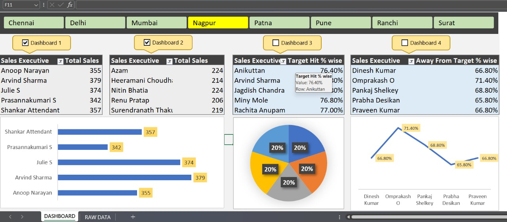

# Multi-City Sales Performance Dashboard Using Excel with Automation 📊

This project showcases a fully automated, multi-city sales analytics dashboard built using Microsoft Excel, Pivot Tables, Slicers, Charts, and VBA-based automation.  
The dashboard provides real-time visibility into total sales, target achievement, variances, and city-wise performance comparisons across multiple regions.

---

## Dashboard Preview:

---

## Key Features:

- **Multi-City Sales Analysis:** Chennai, Delhi, Mumbai, Pune, Nagpur, Patna, Ranchi, Surat  
- **Interactive Dashboards:** Navigate easily across four interconnected dashboards using VBA-driven buttons  
- **Dynamic Reports:** Pivot Table–based analysis for flexible, real-time insights  
- **Slicers & Filters:** Quick filtering by city, sales executive, or product  
- **Visual Analytics:** Bar, Line, and Pie charts for intuitive KPI tracking  
- **Target Monitoring:** Track Target Hit %, Variance, and city-wise performance gaps  
- **Performance Insights:** Identify top-performing and low-performing sales executives  

---

## Business Impact:

- Provides real-time insights for strategic decision-making  
- Helps identify underperforming regions and potential improvement areas  
- Reduces manual work through automated dashboard navigation using VBA  
- Delivers executive-ready visual reports suitable for management presentations  

---

## Getting Started:

1. Download or clone the repository  
2. Open **Sales_Dashboard.xlsx** in Excel  
3. Use Dashboard 1–4 buttons (VBA automated) to switch between views  
4. Explore pivot tables, slicers, and charts to analyze the data  

---

## Project Overview:

**Objective:** Build a corporate-style, automated Excel dashboard that enables multi-city sales analysis, KPI tracking, and interactive reporting.

### Tools & Skills Demonstrated:

- **Microsoft Excel:** Pivot Tables, Slicers, Filters, Charts  
- **VBA Automation:** Button-based navigation and streamlined report flow  
- **Data Analysis:** Target vs Actual calculations, Variance insights, KPI breakdown  
- **Reporting:** Clean, executive-level dashboard visualization  

---

## Connect with Me:

**LinkedIn Profile:** https://www.linkedin.com/in/swatimirashi

**Email ID:** swatimirashi298@gmail.com

---

## Tags:

#Excel #Automation #VBA #PivotTables #SalesAnalytics #Dashboard  
#BusinessIntelligence #DataVisualization #KPITracking #CorporateReporting
